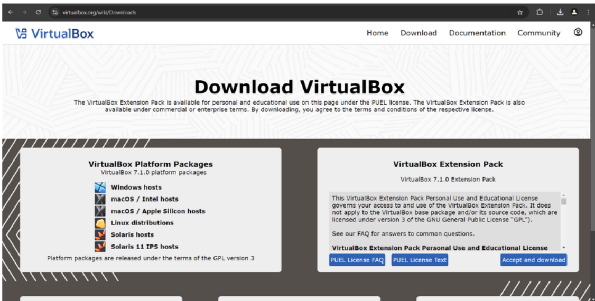
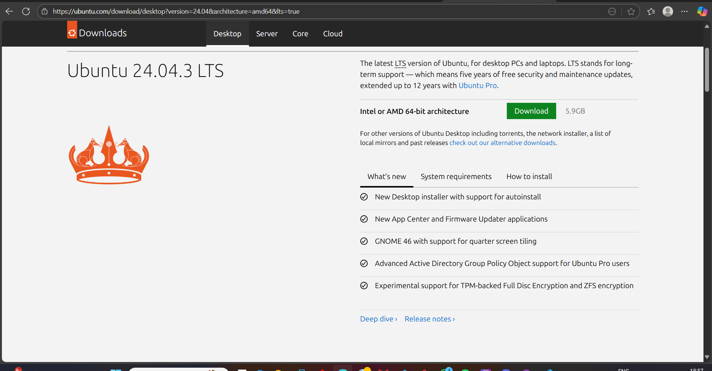
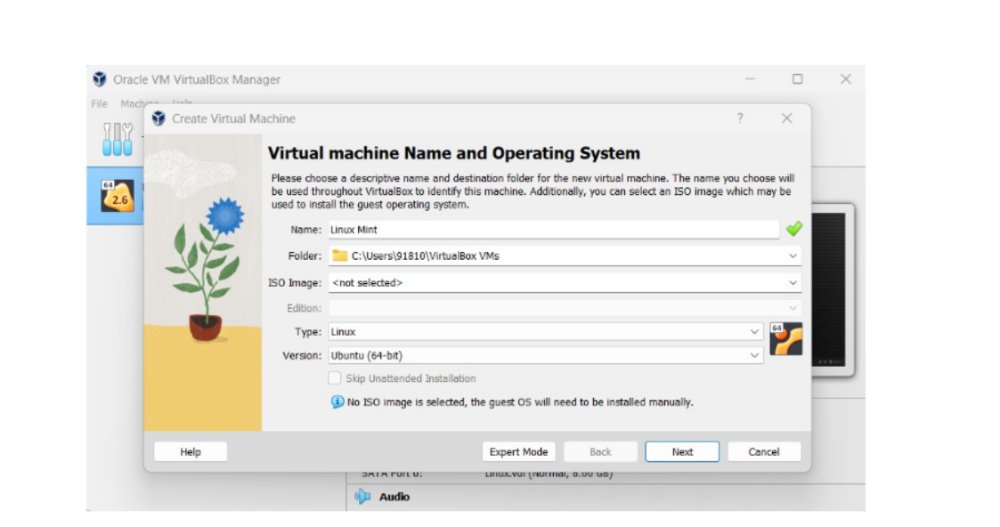
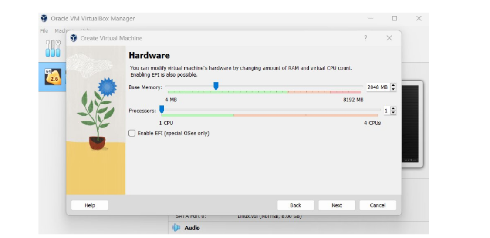
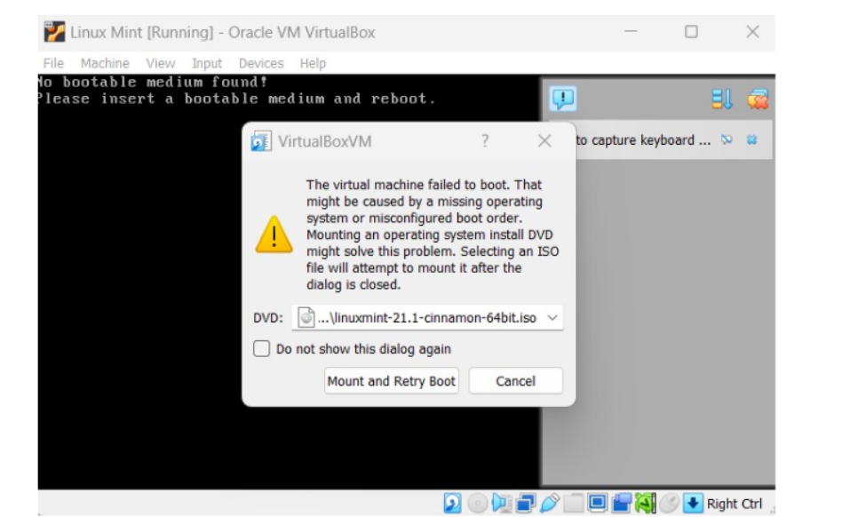

# Installing linux:
* What is linux??
* linux is an open -source, unix-like operating system (os) that serves as the core of many systems, prom personal computers and smartphonesto cloud servers and supercomputers.

Option A – Virtual Machine (Recommended for beginners)

1. Install VirtualBox:

Go to https://www.virtualbox.org/
 and download the latest version for your OS.

# Follow the installer instructions to complete installation.

2. Download Ubuntu LTS ISO:

Visit https://ubuntu.com/download/desktop

Download the latest LTS version (e.g., Ubuntu 24.04 LTS).

3. Create a new VM in VirtualBox:

Open VirtualBox → Click New.

Name your VM (e.g., "UbuntuLab").

Choose Linux and Ubuntu (64-bit).

Allocate minimum 2 GB RAM (2048 MB).

Create a virtual hard disk, dynamically allocated, minimum size 25 GB.

4. Install Ubuntu in the VM:

Start your VM and select the downloaded Ubuntu ISO as the startup disk.

Follow Ubuntu’s installation wizard (language, keyboard, username, password, etc.).

Once installation completes, reboot into your new Ubuntu environment.

# CONGRATULATIONS YOU HAVE SUCCESSFULLY INSTALLED THEUBUNTU LINUX .

# Q1=what are two advantages of installing ubuntu in virtualbox?

ans=1. safe testing environment
    2. easy setup and removal

# Q2=what are two advantages of dual booting instead of using a VM?

ans=1.full harware performence
    2.better graphics & gpu support