Here's a detailed tutorial on basic terminal commands that work on Linux, macOS, and Git Bash (Windows). These commands are essential for navigating and managing files from the terminal, especially for coding and version control (e.g., Git, VS Code, etc.).

# 1. navigation commands

## pwd - Print Working Directory
shows the current location  in the file system .

``` bash
pwd
```

 output example

``` bash
/home/KHUSHANSHU/Linux_Lab
```
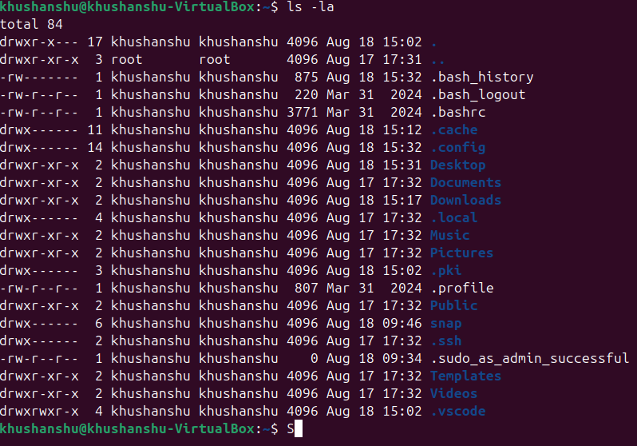

## ls - List Directory Contents
lists files and folder in the current directory .
``` bash
ls
```
 ls -l 
     [detailed list( permissions, size, date)]

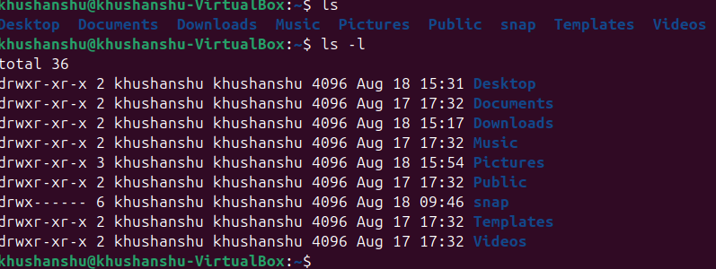

 ls-a 
  [ shows hidden files(those starting with .)]

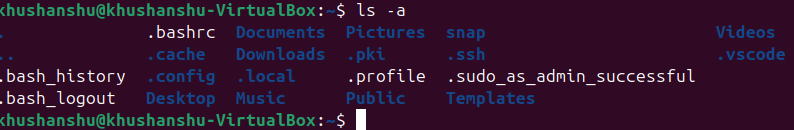

 ls -la
 combined

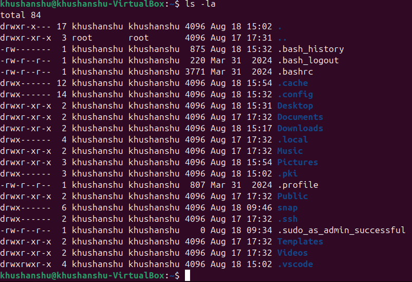


## cd - Change Directory
move into  a directory

``` bash
cd folder_name 
```
exmaples


``` bash
cd document          # go to Documents
cd ..                # go up one level    
cd /                 # go to roots 
cd ~                 # go to home directory
```

# 2. File and Directory Management

##  mkdir - make directory 

create a new folder.

``` bash
mkdir hello_folder
```

## touch - Create File

create an empty file.

``` bash
touch file.txt
```
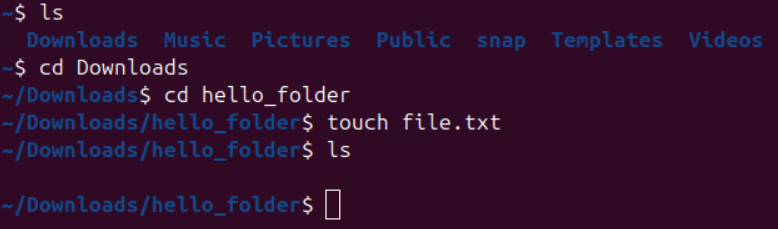

## cp - Copy Files or Directories
``` bash
 cp file.txt file2.txt
 ```

 cp folder:
 ``` bash
 cp -r hello_folder bye_folder
 ```
 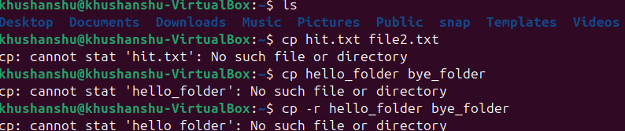

 ## mv - Move or rename Files

 ```bash
mv oldname.txt newname.txt
 ```

  ```bash
 mv file.txt ~/documents/   # Move file
 ```
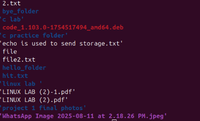

## rm - remove files

 ```bash
 rm file.txt          #delete file
 rm -r folder_name    #delte folder ( recursively)
 ```
 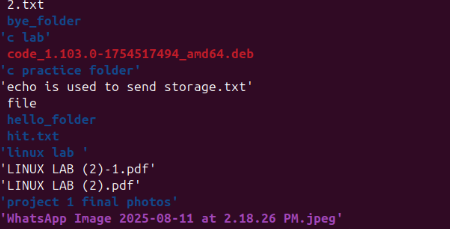

##  be careful!
there is no undo

# 3. File Viewing & Editing

## cat - view file contents
Displays content in terminal.
 ```bash
 cat file.txt
 ```
 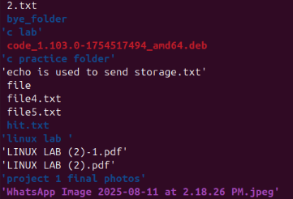

 ## nano -edit file in terminal 
 A basic terminal- based text editor.
  ```bash
  nano file.txt
 ```
 1. use aroow to move
 2. ctrl +o to save
 3. ctrl +x to exit

## clear - clear the terminal
 ```bash
 clear
 ```
 shortcut : CTRL + L

 # 4 . System Commands

   ## echo - print text

  useful for debugging or scripting.

   ```bash
   echo "hellow world"
 ```
 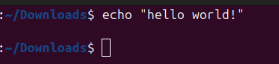
 
  ## whoami - show current user

  ```bash
  whoami
  ```
  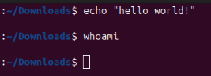

  ## man- Manual for Any Command

  ```bash
  man ls
  ```
  use q to quit the manual.
  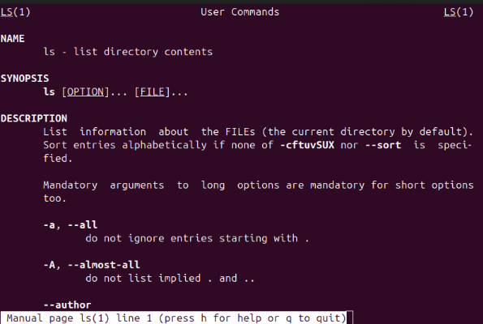

  # 5. searching and finding
  
  ## find - locate files

  ``` bash
  find . -name ".txt"
  ```
  find all .txt files in the current folder and subfolders.

  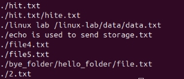

  ## grep - Search Inside Files
  ``` bash
  grep"hello" file.txt
  ```
 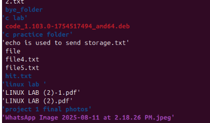

 # 6. helpful shortcut
 
  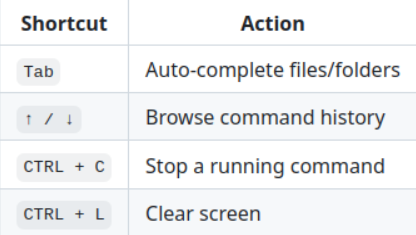

 # 7. Bonus : Chaining Commands
  
   ## run multiple commanands:
   ``` bash
   mkdir test && cd test && touch hello.txt
   ```
   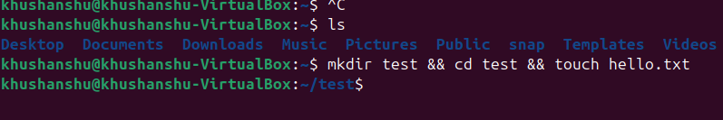

   ## run only if previous commnad succeeds:
   ``` bash
   &&
   ```
   ## run regards of sucess
   ``` bash
   ;
   ```